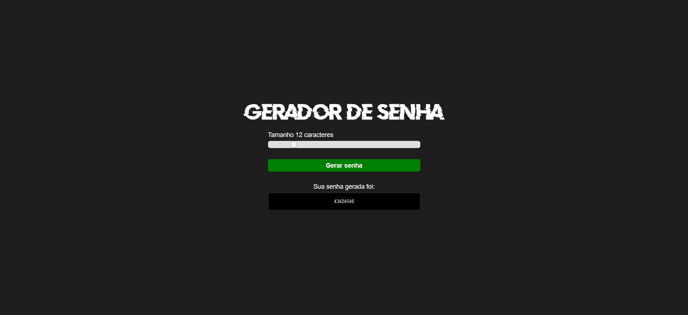

<h1 align="center"> Igor Vargas | Gerador de Senhas </h1>

Gerador de senhas onde é possível definir a quantidade de caracteres desejado.

  <a href="#-tecnologias">Tecnologias</a>&nbsp;&nbsp;&nbsp;|&nbsp;&nbsp;&nbsp;
  <a href="#-projeto">Projeto</a>&nbsp;&nbsp;&nbsp;|&nbsp;&nbsp;&nbsp;

 

  

## 🚀 Tecnologias

Esse projeto foi desenvolvido com as seguintes tecnologias:

- HTML e CSS
- Git e Github

## 💻 Projeto

Gerador de senhas aleatórias com quantidade de caracteres desejado.